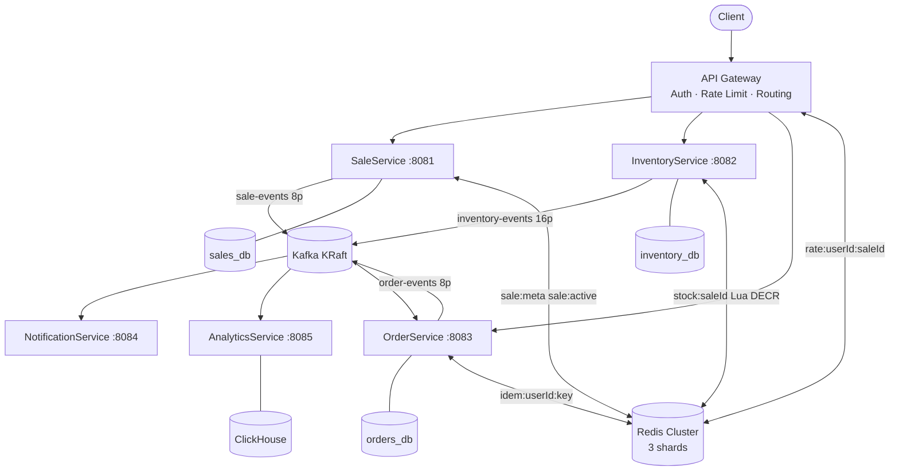
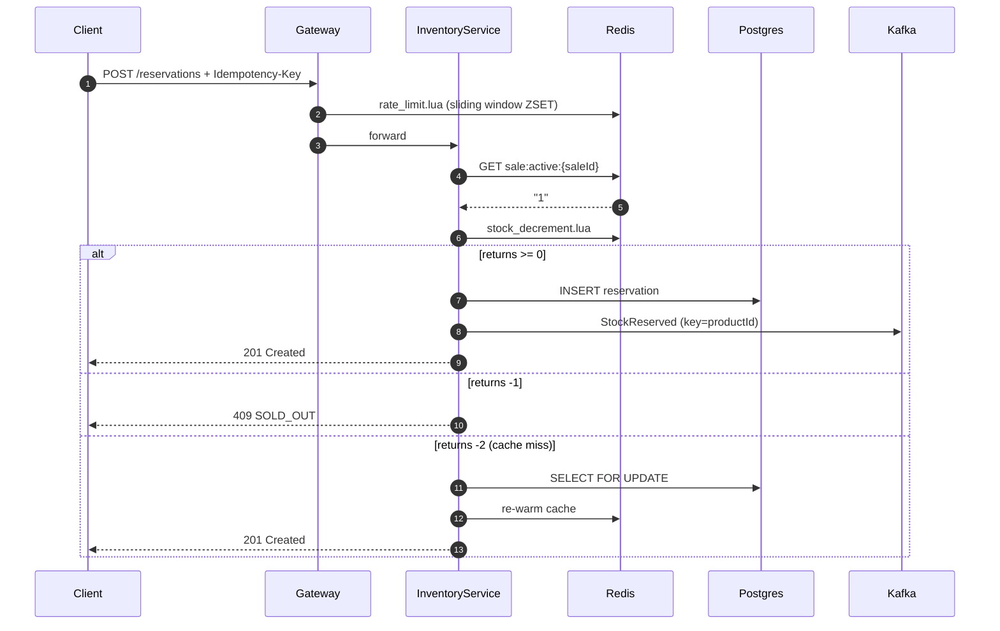
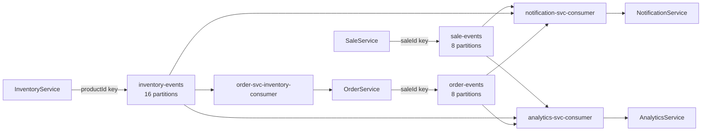

# Flash Sale Platform

A production-grade backend platform for running time-limited flash sales at scale.
Designed to handle thundering-herd traffic, guarantee inventory correctness under
concurrent load, and demonstrate senior-level engineering across distributed systems,
domain-driven design, and operational practice.

> Built as an interview-ready portfolio project. Every architectural decision is
> documented, debated, and traceable to a specific tradeoff.

---

## Table of Contents

- [Problem Statement](#problem-statement)
- [Architecture](#architecture)
- [Services](#services)
- [Technology Stack](#technology-stack)
- [Key Engineering Decisions](#key-engineering-decisions)
- [Running Locally](#running-locally)
- [Build Plan](#build-plan)
- [Documentation](#documentation)
- [Repository Structure](#repository-structure)
- [Interview Topics Demonstrated](#interview-topics-demonstrated)

---

## Problem Statement

Flash sales collapse demand into a narrow time window — thousands of concurrent users
attempting to reserve a single product simultaneously. This creates three hard problems
that break naive implementations:

| Problem | Naive failure | This platform's solution |
|---|---|---|
| **Overselling** | Two users both pass the stock check, both reserve the last unit | Atomic Redis Lua script — single-threaded check-and-decrement |
| **Duplicate orders** | Network timeout causes client retry, creates two orders | Dual-layer idempotency — Redis cache + Postgres keyed constraint |
| **Thundering herd** | 50k concurrent requests hit Postgres on sale start | Redis hot path — `GET /active` never touches Postgres during a live sale |

**Target performance:**
- Reservation P99 latency: **≤ 50ms** at 50,000 concurrent users
- Oversell rate: **0** — enforced by Lua atomicity + `SELECT FOR UPDATE` fallback
- Duplicate order rate: **0** — enforced by idempotency key uniqueness constraint

---

## Architecture

### System topology



### Reservation hot path



### Kafka topics and consumer groups



---

## Services

### SaleService — `:8081`

Owns the `FlashSale` aggregate and its state machine. The only authority that may
transition sale status. Serves `GET /active` exclusively from Redis on the hot path —
Postgres is never queried during an active sale.

```
SCHEDULED ──(saleStart reached)──► ACTIVE ──(saleEnd or stock=0)──► ENDED ──► ARCHIVED
```

| Endpoint | Notes |
|---|---|
| `POST /api/v1/sales` | Create a scheduled sale |
| `GET /api/v1/sales/{id}/active` | Redis-first — ≤ 10ms P99 |
| `PATCH /api/v1/sales/{id}/status` | Admin force-transition |
| `GET /api/v1/sales/{id}/history` | Immutable status audit trail |

### InventoryService — `:8082`

Owns stock levels and reservations. The atomic Lua script is the core correctness
guarantee. No other component can decrement stock.

```lua
-- stock_decrement.lua — executes atomically on the Redis thread
local stock = tonumber(redis.call('GET', KEYS[1]))
if stock == nil then return -2 end  -- cache miss  → fallback to Postgres
if stock <= 0   then return -1 end  -- sold out    → 409
redis.call('DECRBY', KEYS[1], ARGV[1])
return stock - tonumber(ARGV[1])    -- remaining stock
```

**Lua scripts:** `stock_decrement` · `stock_prewarm` · `stock_release` · `stock_reconcile`

### OrderService — `:8083`

Idempotent order creation with transactional outbox. Returns `202 Accepted`
immediately. Outbox poller uses `FOR UPDATE SKIP LOCKED` for concurrent-safe
multi-pod operation.

```
1. Check Redis  idem:{userId}:{key}  → return cached response (fast path)
2. Check Postgres idempotency_keys   → return stored response (durable fallback)
3. Write Order + OutboxEvent in one @Transactional block
4. Outbox poller publishes to Kafka every 500ms
```

### NotificationService — `:8084`

Stateless Kafka consumer. No database. A NotificationService outage has zero
impact on the reservation or order path. Failed dispatches → `notifications.dlq`
after 3 retries with exponential backoff (1s / 8s / 32s).

### AnalyticsService — `:8085`

ClickHouse writer. Micro-batch inserts (1,000 events or 1 second). MergeTree
engine partitioned by month. Analytics lag target: **< 5 seconds**. Zero coupling
to the transactional path — an outage here does not affect a live sale.

---

## Technology Stack

| Layer | Technology | Reason |
|---|---|---|
| Language | **Java 21** | Virtual threads — blocking I/O at scale without reactive complexity |
| Framework | **Spring Boot 3.3** | `spring.threads.virtual.enabled=true` |
| Message bus | **Apache Kafka 3.7** (KRaft) | Async fan-out; per-product partition ordering |
| Cache | **Redis 7.2 Cluster** | Lua atomicity; 3 shards; `allkeys-lru`; AOF `everysec` |
| Databases | **PostgreSQL 16** ×3 | One DB per bounded context; zero cross-service joins |
| Analytics | **ClickHouse 24.3** | Columnar OLAP — sub-second aggregation over millions of rows |
| Containers | **Docker** + Compose | Full local stack in one `make up` |
| Orchestration | **Kubernetes** + **Helm** | HPA per service; max replicas = partition count |
| Observability | **Micrometer** + **OpenTelemetry** | `traceId` across HTTP and Kafka message headers |
| Testing | **Testcontainers** + **jqwik** | Real infrastructure in integration tests; property-based Lua tests |
| Load testing | **Gatling** | 50k concurrent users; pass criteria: p99 < 50ms, 0 oversells |

---

## Key Engineering Decisions

All 15 decisions are in [`docs/adr/01-Decisions.md`](docs/adr/01-Decisions.md)
with the exact alternatives rejected and consequences stated.

| ADR | Decision | The tradeoff |
|---|---|---|
| ADR-001 | Lua atomic stock decrement | No retry storms vs Lua blocking Redis thread on a hung script |
| ADR-002 | Java 21 virtual threads over WebFlux | Readable code + stack traces vs marginally lower throughput ceiling |
| ADR-003 | Kafka for async fan-out only — never RPC | Temporal decoupling vs harder distributed tracing |
| ADR-004 | Transactional Outbox | At-least-once Kafka delivery vs extra table + poll overhead |
| ADR-008 | Database-per-service | Independent failure domains vs no cross-service joins ever |
| ADR-009 | 5 services (retired 3-service v1) | Domain clarity vs 5 deploy targets to operate |
| ADR-012 | Choreography-based saga | No orchestrator SPOF vs implicit flow is harder to visualise |
| ADR-013 | `inventory-events` keyed by `productId` | Per-product ordering vs per-sale ordering |

---

## Running Locally

### Prerequisites

```bash
docker --version        # 24.0+
docker compose version  # v2.x  (not docker-compose v1)
make --version          # 3.81+
redis-cli --version     # 7.x  (for health checks)
java --version          # 21+  (for running services)
```

### Start everything

```bash
git clone https://github.com/yourhandle/flash-sale-platform
cd flash-sale-platform

cp deployment/docker/.env.example deployment/docker/.env

make up       # starts 17 containers: Postgres x3, Redis x6, Kafka, ClickHouse, UIs
make health   # validates all 5 infrastructure components
```

**Expected:**

```
=== PostgreSQL ===
  ✓ sales_db      ✓ inventory_db      ✓ orders_db
=== Redis Cluster ===
  cluster_state:ok    cluster_known_nodes:6    cluster_size:3
=== Kafka ===
  ✓ Broker reachable on localhost:9092
=== ClickHouse ===
  ✓ HTTP interface on port 8123
```

### Service ports

| Service | Port | Tool |
|---|---|---|
| SaleService | 8081 | `curl localhost:8081/actuator/health` |
| InventoryService | 8082 | `curl localhost:8082/actuator/health` |
| OrderService | 8083 | `curl localhost:8083/actuator/health` |
| NotificationService | 8084 | |
| AnalyticsService | 8085 | |
| Kafka UI | 18080 | http://localhost:18080 |
| RedisInsight | 18081 | http://localhost:18081 |
| sales\_db (Postgres) | 5432 | `make db-sales` |
| inventory\_db (Postgres) | 5433 | `make db-inventory` |
| orders\_db (Postgres) | 5434 | `make db-orders` |
| ClickHouse HTTP | 8123 | `curl localhost:8123/ping` |

### Makefile reference

```bash
make up                     # start all infrastructure
make down                   # stop (volumes preserved)
make clean                  # stop + wipe all data  ⚠
make health                 # full health check
make kafka-create-topics    # create topics manually
make kafka-lag              # consumer group lag
make redis-cluster-info     # cluster state
make redis-stock-watch SALE_ID=uuid  # watch counter drain live
make db-inventory           # psql shell
make help                   # all targets
```

### Run tests

```bash
# Unit (fast, no Docker required)
./gradlew :services:inventory-service:test --tests "*.unit.*"

# Integration (Testcontainers — requires Docker)
./gradlew :services:inventory-service:test --tests "*.integration.*"

# Architecture boundary enforcement (ArchUnit)
./gradlew :testing:contract:test

# Chaos — Kafka killed mid-sale, verify 0 events lost
./gradlew :testing:chaos:test
```

---

## Build Plan

10 weeks. Each week ships working, testable software. No week ends with code that
cannot be run.

| Week | Phase | Deliverable |
|---|---|---|
| 1 | Foundation | Docker Compose stack — Postgres ×3, Redis Cluster, Kafka KRaft, ClickHouse ✅ |
| 2 | Core | SaleService — `FlashSale` aggregate, Java 21 sealed `SaleStatus`, REST API |
| 3 | Core | InventoryService — `Product` aggregate, Lua scripts, Postgres fallback |
| 4 | Core | `Reservation` aggregate — idempotency, expiry sweep, 1500-concurrent load test |
| 5 | Core | OrderService — Transactional Outbox, dual-layer idempotency |
| 6 | Integration | Kafka wiring — outbox poller, saga consumer, ACL translator |
| 7 | Integration | SaleService Redis cache + sliding window rate limiter |
| 8 | Resilience | Retry/DLQ/NotificationService — error classification, chaos test |
| 9 | Observability | AnalyticsService + Micrometer + OpenTelemetry trace propagation |
| 10 | Production | Helm/Kubernetes + Gatling 50k users — p99 < 50ms, 0 oversells |

Full detail with DoD checklists, risks, and interview questions per week:
[`docs/architecture/Build-Plan.md`](docs/architecture/Build-Plan.md)

---

## Documentation

All design documents exist before implementation. The code is the last artefact
produced, not the first.

| Document | What it contains |
|---|---|
| [`Final-Spec-Council.md`](docs/architecture/Final-Spec-Council.md) | Binding spec — service boundaries, Kafka design, Redis layers, 15 ADRs |
| [`DomainModel.md`](docs/architecture/DomainModel.md) | Aggregates, entities, value objects, bounded contexts, ACL map |
| [`DatabaseSchema.md`](docs/architecture/DatabaseSchema.md) | Every table, index, constraint, and query pattern across all 3 schemas |
| [`KafkaDesign.md`](docs/architecture/KafkaDesign.md) | Topic design, partition key rationale, consumer groups, retry + DLQ topology |
| [`RedisDesign.md`](docs/architecture/RedisDesign.md) | 5-layer key structure, TTL contracts, all Lua scripts with line-by-line rationale |
| [`PRD-FlashSalePlatform.md`](docs/architecture/PRD-FlashSalePlatform.md) | 10 user stories, 38 functional requirements, 31 NFRs, 16 edge cases |
| [`01-Decisions.md`](docs/adr/01-Decisions.md) | 15 ADRs — each with chosen, alternatives rejected, consequences |
| [`Build-Plan.md`](docs/architecture/Build-Plan.md) | 10-week roadmap with DoD, risks, interview questions per week |
| [`INFRASTRUCTURE.md`](INFRASTRUCTURE.md) | Operations guide for new engineers |
| [`incidents/`](incidents/) | Runbooks, pre-sale playbook, postmortems |

---

## Repository Structure

```
flash-sale-platform/
│
├── services/                     # One directory per bounded context
│   ├── sale-service/
│   │   ├── src/main/java/…/
│   │   │   ├── domain/           # Aggregates, VOs, events — zero Spring dependencies
│   │   │   │   ├── aggregate/    # FlashSale.java
│   │   │   │   └── vo/           # SaleId.java  SaleWindow.java  SaleStatus.java
│   │   │   ├── application/      # Use cases — orchestrate domain + call ports
│   │   │   ├── infra/            # Spring, JPA, Redis, Kafka implementations
│   │   │   └── api/              # @RestController + DTOs only
│   │   └── src/main/resources/
│   │       └── lua/              # rate_limit.lua
│   │
│   ├── inventory-service/
│   │   └── src/main/resources/
│   │       └── lua/              # stock_decrement.lua  stock_prewarm.lua
│   │                             # stock_release.lua    stock_reconcile.lua
│   │
│   ├── order-service/            # OutboxPoller.java  InventoryEventTranslator.java
│   ├── notification-service/     # Stateless — no database, no schema
│   └── analytics-service/        # ClickHouse writer
│
├── docs/
│   ├── architecture/             # All design documents (see Documentation table)
│   ├── adr/                      # ADR-001 through ADR-013
│   └── api/                      # openapi.yaml
│
├── deployment/
│   ├── docker/
│   │   ├── docker-compose.yml    # 17 containers — full local stack
│   │   ├── config/redis-node.conf
│   │   └── init-scripts/         # Per-database bootstrap SQL
│   ├── helm/charts/              # One Helm chart per service + HPA
│   └── terraform/modules/        # EKS, RDS, ElastiCache, MSK
│
├── testing/
│   ├── contract/                 # ArchUnit — no inventory.* imports in order.*
│   ├── chaos/                    # Kafka kill test, Redis failure test
│   └── fixtures/                 # Shared Testcontainers configuration
│
├── benchmarks/
│   └── gatling/simulations/      # FlashSaleSimulation.scala — 50k users
│
├── incidents/
│   ├── runbooks/                 # redis-failure.md  kafka-dlq-depth.md
│   ├── playbooks/                # pre-sale-checklist.md
│   └── postmortems/              # PM-001-Week01-Infrastructure.md
│
├── Makefile                      # make up / health / clean / kafka-* / db-*
├── build.gradle                  # Root Gradle multi-project — Java 21 toolchain
└── settings.gradle               # include 'services:inventory-service' etc.
```

**Domain boundary enforced by ArchUnit — a failing test, not a convention:**

```java
// testing/contract/ArchitectureBoundaryTest.java
@ArchTest
static final ArchRule orderServiceMustNotImportInventoryTypes =
    noClasses()
        .that().resideInAPackage("com.flashsale.order-service..")
        .should().dependOnClassesThat()
        .resideInAPackage("com.flashsale.inventory-service.domain..");
```

---

## Interview Topics Demonstrated

Built to answer the hardest distributed systems questions from first-person
experience — not theory.

### Concurrency and correctness

**"How do you prevent overselling under 50k concurrent requests?"**
Redis Lua script executes atomically on the Redis thread. No WATCH/MULTI/EXEC
retry storms. Three return codes (-2 miss / -1 sold-out / ≥0 success) drive
different paths. Postgres `SELECT FOR UPDATE` is the fallback when Redis is
unavailable — correctness is preserved at the cost of throughput.

**"How do you guarantee idempotency across retries?"**
Dual-layer: Redis cache (24h TTL, fast path) backed by Postgres `idempotency_keys`
table (permanent). `UNIQUE (idempotency_key)` is the database-level constraint —
no application logic error can produce a duplicate order. Verified by a test that
fires 5 retries and asserts exactly 1 row in the database.

### Distributed systems

**"How do you guarantee at-least-once Kafka delivery without data loss?"**
Transactional Outbox — Order row and OutboxEvent row are written in a single
`@Transactional` block. If Kafka is down for 5 minutes, events accumulate in the
`order_outbox` table. The poller catches up on recovery. Kafka is never called
inside a DB transaction — that would create a two-phase commit without the guarantees.

**"Why `productId` and not `saleId` as the Kafka partition key for inventory-events?"**
Two concurrent reservations for the same product must be processed sequentially
by the OrderService consumer to confirm them in the correct order. `saleId` would
scatter same-product events across partitions, breaking per-product ordering.
`saleId` is the correct key for `sale-events` and `order-events` — those need
per-sale ordering.

**"Choreography vs. orchestration — when would you choose each?"**
Choreography here because 5 services do not warrant a central orchestrator that
becomes a SPOF. Would choose orchestration above ~10 services where implicit saga
flows become operationally unobservable. The tradeoff is that distributed tracing
substitutes for the visibility an orchestrator provides.

### Redis

**"Walk me through your Redis architecture."**
Five layers with distinct contracts: stock counter (Lua DECR, sale-duration TTL),
sale metadata hot-path (Hash, same TTL), sliding window rate limiter (Sorted Set,
60s), session cache (Hash, 5-min rolling), idempotency cache (String, fixed 24h).
Each layer has a Postgres fallback. Redis is never the source of truth.

**"What happens when Redis goes down mid-sale?"**
Circuit breaker opens after 5 consecutive failures. Stock counter falls back to
`SELECT FOR UPDATE` on Postgres (throughput degrades, correctness holds). Rate
limiter fails open with an audit log. Session cache misses fall back to JWT
validation (stateless). Sale metadata falls back to Postgres query. Alert fires.

### DDD

**"Why is Reservation a separate aggregate root and not a child of Product?"**
A Reservation has an independent lifecycle — it can expire while the product still
has stock. Embedding it in Product would mean loading and locking the Product
aggregate on every expiry event, creating unnecessary coupling and a concurrency
bottleneck. The Lua script decrement is per-sale (Product scoped); the reservation
lifecycle is per-user-per-sale (Reservation scoped).

**"What is an anti-corruption layer and where do you have one?"**
Between InventoryContext and OrderContext. OrderService never imports `Reservation`
from InventoryService packages — ArchUnit enforces this as a failing test. The
`InventoryEventTranslator` maps `StockReservedPayload` → `PurchaseIntent` at the
Kafka consumer. A rename inside InventoryContext is invisible to OrderContext.

### Java 21

**"Why virtual threads over WebFlux for this workload?"**
This workload is I/O-heavy and blocking — JDBC calls, Redis commands, Kafka
publishes. Virtual threads park during I/O and resume without a platform thread.
That gives near-reactive throughput with imperative code. Stack traces remain
readable. Tests are straightforward JUnit. No Project Reactor mental model needed.

**"How do Java 21 features appear in your domain model?"**
Sealed interfaces for `SaleStatus` — the compiler rejects any `switch` that misses
a case, making illegal state transitions a compile error, not a runtime exception.
Records for all value objects — immutable by definition, no boilerplate equals/hash.
Compact constructors enforce invariants (e.g., `Quantity` rejects values < 1) at
construction time, not in service layer code.

---

## Postmortems on File

Production-grade projects have postmortems. This one does too — including bugs
found before deployment.

| ID | Summary | Severity | Status |
|---|---|---|---|
| [PM-001](incidents/postmortems/PM-001-Week01-Infrastructure.md) | Redis cluster-init not idempotent + Postgres startup failure from unquoted `log_line_prefix`. Caught in pre-deployment review. | P2 | Closed |

---

*Architecture reviewed by a council of Google, Uber, Amazon, and Atlassian staff engineers.*
*Every decision has an ADR. Every production bug has a postmortem.*
*Every week ships working software.*