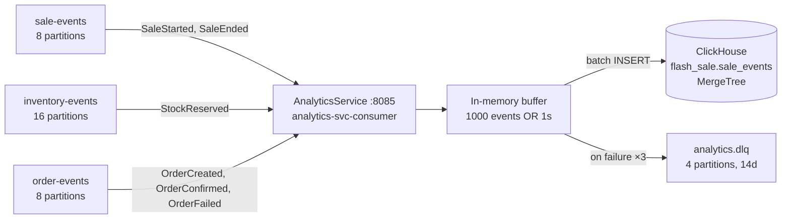
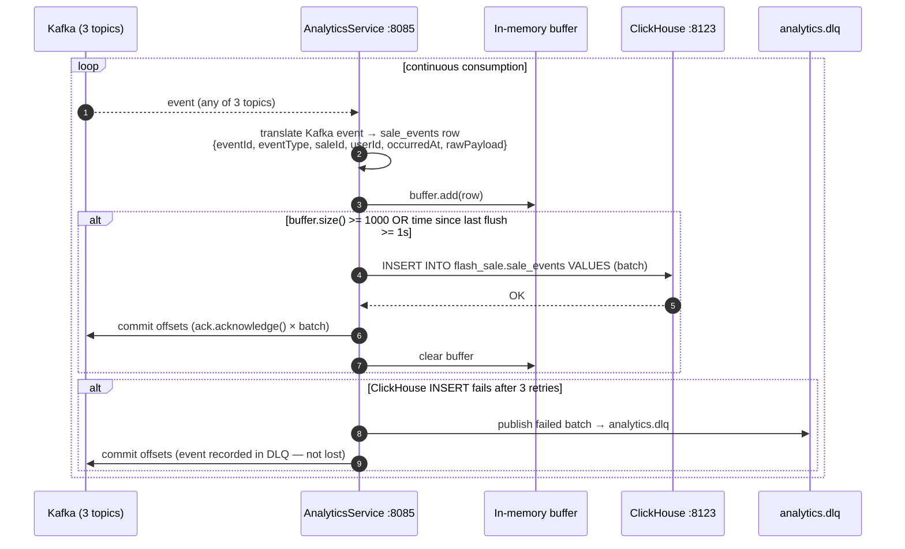

# Analytics-Flow.md
## Flash Sale Platform — Analytics Flow
**Audience:** Interview preparation — data pipeline from Kafka to ClickHouse
**Covers:** AnalyticsService ingestion · ClickHouse schema · Query patterns · DLQ

---

## Data Flow Diagram



---

## Ingestion Flow



### Why micro-batch (1000 events or 1 second)?

**Not one event at a time:** ClickHouse is optimised for batch inserts. Each `INSERT` has overhead — network round-trip, merge scheduling, metadata update. Inserting 1,000,000 rows one row at a time produces 1,000,000 round-trips. ClickHouse documentation recommends batches of at least 1,000 rows for production throughput.

**Not one large batch:** Waiting for 10,000 events before flushing increases analytics lag. During a slow period (few events), the 1-second timer ensures data reaches ClickHouse within 1 second regardless of batch size.

**Result:** Analytics lag target `< 5 seconds` end-to-end (Kafka publish → ClickHouse queryable).

---

## ClickHouse Schema — Annotated

```sql
CREATE TABLE flash_sale.sale_events
(
    -- Identity
    event_id      String,                        -- UUID from Kafka message key
    event_type    LowCardinality(String),        -- ~10 distinct values across millions of rows
    event_version LowCardinality(String),        -- for schema evolution tracking

    -- Business keys
    sale_id       String,                        -- bloom_filter index applied
    user_id       String,

    -- Timestamps
    occurred_at   DateTime64(3, 'UTC'),          -- when the business event happened
    ingested_at   DateTime64(3, 'UTC')           -- when AnalyticsService wrote this row
        DEFAULT now64(3),

    -- Full event payload for flexible extraction
    raw_payload   String,                        -- full JSON — no schema migration needed

    -- Skip indexes
    INDEX idx_sale_id    sale_id    TYPE bloom_filter(0.01) GRANULARITY 4,
    INDEX idx_event_type event_type TYPE set(10)            GRANULARITY 4
)
ENGINE = MergeTree()
PARTITION BY toYYYYMM(occurred_at)           -- one set of files per month
ORDER BY (sale_id, occurred_at, event_id)    -- primary sort key
TTL occurred_at + INTERVAL 90 DAY;          -- automatic expiry
```

### Every decision explained

**`LowCardinality(String)` for `event_type`**
~10 distinct values (`STOCK_RESERVED`, `ORDER_CONFIRMED`, `SALE_STARTED`...) across millions of rows. ClickHouse stores as a dictionary-encoded integer. String comparison becomes integer comparison. The `set(10)` skip index stores the full set of values per granule — `WHERE event_type IN (...)` skips entire granules that don't contain the target values.

**`PARTITION BY toYYYYMM(occurred_at)`**
Separate physical data files per month. `WHERE occurred_at >= now() - 30 DAY` skips all months outside the range without reading them. With 90-day TTL: maximum 3 months of data files exist at any time. Dashboard queries for the last 30 days touch 1–2 months.

**`ORDER BY (sale_id, occurred_at, event_id)`**
Rows are physically sorted by this key within each partition. `WHERE sale_id = ?` scans a contiguous range. `GROUP BY sale_id ORDER BY occurred_at` retrieves pre-sorted data. No additional sort step needed.

**`bloom_filter(0.01)` on `sale_id`**
Probabilistic skip index with 1% false positive rate. Before reading a data granule (8192 rows), ClickHouse checks the filter. "This `sale_id` is definitely not here" → skip the entire granule. For single-sale drill-downs, most granules are skipped.

**`raw_payload String`**
Full JSON event from Kafka, stored as-is. New event fields are available immediately via `JSONExtractString(raw_payload, 'newField')` — no schema migration on a table with millions of rows.

**`TTL occurred_at + INTERVAL 90 DAY`**
ClickHouse automatically expires and deletes rows older than 90 days. No manual cleanup job, no VACUUM equivalent, no scheduled DELETE.

---

## Query Patterns Using Your Schema

### Sales conversion funnel

```sql
SELECT
    sale_id,
    countIf(event_type = 'STOCK_RESERVED')  AS reservations,
    countIf(event_type = 'ORDER_CONFIRMED') AS confirmed_orders,
    countIf(event_type = 'ORDER_FAILED')    AS failed_orders,
    round(
        countIf(event_type = 'ORDER_CONFIRMED') * 100.0
        / nullIf(countIf(event_type = 'STOCK_RESERVED'), 0)
    , 1)                                    AS conversion_pct
FROM flash_sale.sale_events
WHERE occurred_at >= now() - INTERVAL 7 DAY    -- partition pruning: 1-2 months of files
GROUP BY sale_id
ORDER BY reservations DESC
LIMIT 20;
-- At 10M rows: ~400ms
```

### Reservation velocity (per-minute throughput during first 5 minutes)

```sql
SELECT
    sale_id,
    toStartOfMinute(occurred_at) AS minute,
    countIf(event_type = 'STOCK_RESERVED') AS reservations_in_minute
FROM flash_sale.sale_events
WHERE sale_id = ?
  AND event_type = 'STOCK_RESERVED'
  AND occurred_at BETWEEN ? AND ? + INTERVAL 5 MINUTE
GROUP BY sale_id, minute
ORDER BY minute;
-- bloom_filter on sale_id skips most granules
-- set(10) index on event_type eliminates non-reservation rows
-- At 10M rows: ~50ms for a single sale lookup
```

### Hourly revenue with running total

```sql
SELECT
    toStartOfHour(occurred_at)              AS hour,
    sale_id,
    countIf(event_type = 'ORDER_CONFIRMED') AS orders,
    sumIf(
        JSONExtractFloat(raw_payload, 'amount'),
        event_type = 'ORDER_CONFIRMED'
    )                                        AS revenue,
    sum(revenue) OVER (
        PARTITION BY sale_id
        ORDER BY hour
    )                                        AS running_revenue
FROM flash_sale.sale_events
WHERE occurred_at >= now() - INTERVAL 7 DAY
  AND event_type = 'ORDER_CONFIRMED'
GROUP BY hour, sale_id
ORDER BY hour ASC;
-- Reads only: event_type, sale_id, occurred_at, raw_payload columns
-- Other columns never touched — columnar advantage
-- At 10M rows: ~350ms
```

### Top products by sell-through rate

```sql
SELECT
    JSONExtractString(raw_payload, 'productName') AS product,
    sale_id,
    countIf(event_type = 'STOCK_RESERVED')        AS reserved,
    countIf(event_type = 'ORDER_CONFIRMED')        AS sold,
    round(sold * 100.0 / nullIf(reserved, 0), 1)  AS sellthrough_pct,
    -- Minutes from first reservation to sell-out
    dateDiff('minute',
        minIf(occurred_at, event_type = 'STOCK_RESERVED'),
        maxIf(occurred_at, event_type = 'STOCK_RESERVED')
    )                                              AS minutes_to_sellout
FROM flash_sale.sale_events
WHERE occurred_at >= today() - 7
  AND event_type IN ('STOCK_RESERVED', 'ORDER_CONFIRMED')
GROUP BY product, sale_id
ORDER BY sellthrough_pct DESC
LIMIT 10;
-- set(10) skip index: only granules containing STOCK_RESERVED or ORDER_CONFIRMED scanned
-- At 10M rows: ~600ms
```

---

## Why These Queries Cannot Run on PostgreSQL

| Reason | Detail |
|---|---|
| Cross-service data | Revenue is in `orders_db`. Product names are in `inventory_db`. Sale metadata is in `sales_db`. Zero cross-database joins permitted (ADR-008). ClickHouse has everything in one table. |
| Row-oriented scan | Postgres reads every column in every row even when one column is needed. At 10M rows, a `GROUP BY` on `event_type` reads the full 10M row dataset. ClickHouse reads only the `event_type` column. |
| OLTP impact | Analytics queries on `orders_db` compete with reservation INSERTs for I/O, WAL writer, buffer pool. During flash sale peak, a GROUP BY can degrade reservation P99. ClickHouse is a separate container with no shared resources. |
| No `LowCardinality` | Postgres stores `event_type` as TEXT bytes per row. No dictionary encoding. Every comparison is a string operation. |
| No partition pruning | Postgres table partitioning requires explicit management. ClickHouse `PARTITION BY toYYYYMM` is automatic and transparent to queries. |

---

## Failure Handling

| Scenario | What happens |
|---|---|
| ClickHouse unavailable | AnalyticsService buffer accumulates in memory. After 3 failed INSERT retries, batch published to `analytics.dlq`. Kafka offsets committed — events not reprocessed. DLQ retains for 14 days for manual replay. |
| AnalyticsService pod crash | Consumer group rebalances. New pod resumes from last committed offset. In-memory buffer lost — events between last flush and crash are reprocessed (at-least-once). ClickHouse `event_id` deduplication prevents duplicate rows. |
| AnalyticsService slow (lag growing) | Kafka retains `inventory-events` for 3 days. Scale AnalyticsService pods up to 16 (one per partition). Lag drains. No data loss — events persist in Kafka until retention expires. |
| Kafka unavailable | No Kafka → no events → no new rows in ClickHouse. Existing data queryable. Once Kafka recovers, AnalyticsService resumes from last committed offset. Analytics lag grows during outage, then drains. |

---

## ClickHouse in the Stack

```
flash-sale-clickhouse container
├── Image:   clickhouse/clickhouse-server:24.3.3-alpine
├── HTTP:    localhost:8123   (JDBC, health checks: curl .../ping → Ok.)
├── TCP:     localhost:19000  (remapped from 9000 — host conflict)
├── Data:    clickhouse-data volume  (column files)
├── Logs:    clickhouse-logs volume  (separate — log growth can't fill data)
└── ulimits: nofile=262144   (one file per column per shard — default 1024 is hit immediately)
```

---

## Interview Talking Points

**"How does AnalyticsService avoid losing events if ClickHouse is temporarily down?"**
Events accumulate in Kafka. AnalyticsService commits offsets only after a successful ClickHouse INSERT. If ClickHouse is down, the poller retries 3 times then publishes the batch to `analytics.dlq`. The Kafka offset is still committed — the event is recorded in the DLQ. Operators replay the DLQ to ClickHouse after recovery. 14-day DLQ retention gives a wide recovery window.

**"What is the analytics lag and how is it achieved?"**
Target: events queryable in ClickHouse within 5 seconds of the Kafka publish. The micro-batch flush (1,000 events or 1 second) means the maximum ClickHouse lag from the buffer is 1 second. Add Kafka consume latency (~100ms) and ClickHouse write latency (~200ms). End-to-end: ~1.5 seconds typical, well within the 5-second target.

**"Why store `raw_payload` as a JSON string instead of structured columns?"**
Event schemas evolve. A new `discountPct` field added to `StockReserved` in month 4 is immediately available as `JSONExtractFloat(raw_payload, 'discountPct')` without any schema migration. If `raw_payload` were a structured type, adding a column to a 100M-row ClickHouse table takes significant time and coordination. The cost — JSON extraction at query time — is acceptable at analytics latency targets (sub-second).

**"An AnalyticsService outage runs for 2 hours. What data is lost?"**
Nothing, if Kafka retention is longer than the outage. `inventory-events` retains for 3 days. `order-events` and `sale-events` retain for 3–7 days. When AnalyticsService recovers, it resumes from the last committed offset and replays the 2 hours of missed events into ClickHouse. Analytics data is eventually consistent — it arrives late, but it arrives.

---
*ADR-018 (ClickHouse over PostgreSQL) · ADR-006 (Kafka async fan-out)*
*`deployment/docker/init-scripts/clickhouse/01-init.sql` (verified schema)*