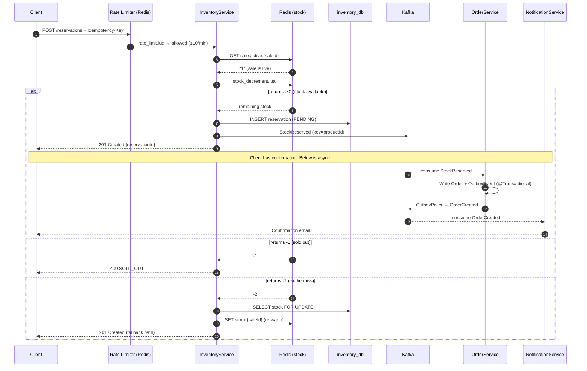

# Flash Sale Platform — Business Flow
**Audience:** Interview preparation
**Source:** Final-Spec-Council.md v2.0 · 01-Decisions.md (ADR-003, ADR-004, ADR-006, ADR-008, ADR-009, ADR-013)

---

## Problem Statement

A flash sale collapses demand into a narrow time window. 50,000 concurrent users
attempt to buy a product with 1,000 units available — all at the same second.

Three things must be true simultaneously:

| Invariant | Target | What breaks it |
|---|---|---|
| No overselling | 0 oversells | Race condition between stock check and decrement |
| No duplicates | 0 duplicate orders | Network retry after client timeout |
| Low latency | P99 ≤ 50ms | Thundering herd against Postgres on sale start |

A naive implementation fails all three.

---

## Why Flash Sales Are Technically Difficult

### Problem 1 — The race condition
Two threads both read `stock = 1`, both pass the check, both decrement. Stock goes to
`-1`. Two people bought the last unit. The Java `synchronized` keyword only works
within one JVM — it cannot coordinate across multiple service pods.

**Fix:** Lua script in Redis. Executes atomically on the Redis thread. One operation,
no gap between check and decrement. Not possible to race.

### Problem 2 — Database lock contention
The distributed fix to Problem 1 is `SELECT FOR UPDATE` on Postgres. It works —
but at 50,000 concurrent requests, every request waits for the same row lock. The
queue grows. P99 goes from 5ms to 5s. The connection pool exhausts. Service falls over.

**Fix:** Redis is the hot path. Postgres `SELECT FOR UPDATE` is the fallback only,
activated when Redis returns a cache miss (`-2`). Under normal load, Postgres never
sees a reservation request.

### Problem 3 — Duplicate requests
Network timeouts are guaranteed. A buyer clicks Buy Now. The browser times out at
800ms and retries. The server processed the first request — the client never knew.
Without protection: two reservations for one buyer.

**Fix:** `Idempotency-Key` header on every mutating request. Dual-layer check:
Redis (`idem:{userId}:{key}`, 24h TTL) → Postgres `idempotency_keys` table.
Same key always returns the same response. No second processing.

### Problem 4 — Thundering herd at sale start
At T+0, 50,000 users hit `GET /active` simultaneously. If every request reads sale
status from Postgres, one row is hit 50,000 times in one second. Postgres collapses.

**Fix:** SaleService pre-warms `sale:active:{saleId}` in Redis 60 seconds before
sale start. At T+0, every request returns from Redis in < 1ms. Postgres sees zero reads.

### Problem 5 — Cascade failures
Notification service is rate-limited by the email provider. In a synchronous chain,
a slow NotificationService makes the reservation endpoint slow.

**Fix:** Kafka. InventoryService publishes `StockReserved` and returns `201`
immediately. NotificationService consumes the event independently. If it is down for
10 minutes, the buyer still has their reservation. The email arrives late.

---

## Buy Now Request Flow

A user clicks Buy Now. Here is what happens, step by step.

### Synchronous path (user is waiting for this)

```
1. Client          →  POST /api/v1/reservations + Idempotency-Key header

2. Rate limiter     →  rate_limit.lua checks rate:{userId}:{saleId} in Redis
                       Sliding window Sorted Set, 60s, max 10 req/min
                       If exceeded → 429 Too Many Requests (stops here)

3. InventoryService →  GET sale:active:{saleId} from Redis
                       If missing → 409 SALE_NOT_ACTIVE (stops here)

4. InventoryService →  Execute stock_decrement.lua on Redis
                       Returns -2 → cache miss → fallback to Postgres FOR UPDATE
                       Returns -1 → 409 SOLD_OUT (stops here)
                       Returns ≥ 0 → success, remaining stock

5. InventoryService →  INSERT INTO reservations (inventory_db)
                       Reservation row created with status = PENDING
                       expires_at = now + 10 minutes

6. InventoryService →  Publish StockReserved to inventory-events (key = productId)

7. Client          ←  201 Created {reservationId, expiresAt}
```

The client has their confirmation. Everything below is asynchronous.

### Asynchronous path (user is not waiting)

```
8.  OrderService    ←  Consumes StockReserved from inventory-events
                       ACL translation: StockReservedPayload → PurchaseIntent

9.  OrderService    →  Writes Order + OutboxEvent in one @Transactional block
                       (Both succeed or both fail — no partial state)

10. Outbox poller   →  SELECT FOR UPDATE SKIP LOCKED every 500ms
                       Publishes OrderCreated to order-events

11. NotificationService ← Consumes OrderCreated
                           Dispatches confirmation email to buyer
```

---

## What Happens When Inventory Reaches Zero

When the 1,000th unit is reserved, Redis holds `stock:{saleId} = 0`.

The 1,001st request executes the Lua script:

```lua
local stock = tonumber(redis.call('GET', KEYS[1]))
if stock <= 0 then return -1 end   -- floor enforced here
```

Returns `-1`. InventoryService maps this to `409 SOLD_OUT`. The request:
- Never touches Postgres
- Never writes a reservation row
- Never publishes a Kafka event
- Never reaches OrderService or NotificationService

When SaleService detects `totalStock - reservations = 0`, it transitions the sale to
`ENDED` and immediately deletes `sale:active:{saleId}` from Redis. Subsequent
requests fail at step 3 without reaching InventoryService at all.

---

## Why Overselling Is Dangerous

Overselling means you sold a unit you do not have. This is not just a bug.

| Layer | Impact |
|---|---|
| Operational | Must contact buyers post-purchase to cancel. Every cancellation is a support ticket, a refund, a lost customer. |
| Financial | Refund processing fees. Chargebacks from buyers who dispute with their bank carry additional penalties. |
| Legal | In many jurisdictions, selling what you cannot deliver violates consumer protection law. |
| Trust | A buyer who gets a confirmation, tells friends, then gets a cancellation does not return. Reputational damage is disproportionate to the technical cause. |

**The platform's contract:** `oversell rate = 0`. Not "minimise overselling." Zero.
This is why the Lua script is non-negotiable — it is the only mechanism that
provides an atomic floor check under concurrent load.

---

## Sequence Diagram



---

## Technology Mapping

| Business Problem | Technology | Why this, not the alternative |
|---|---|---|
| Prevent oversell under 50k concurrent requests | Redis Lua script (`stock_decrement.lua`) | Executes atomically on Redis thread. WATCH/MULTI/EXEC causes retry storms under load. |
| Postgres fallback when Redis is unavailable | `SELECT stock FOR UPDATE` | Serialises writes correctly. Acceptable latency degradation. Rejecting requests (503) is worse than slowing them down. |
| Prevent duplicate orders on retry | Idempotency-Key, dual-layer check | Redis (fast) → Postgres (durable). Redis-only risks eviction before 24h TTL. |
| Serve sale status at 50k RPS without hitting Postgres | `sale:active:{saleId}` key in Redis | Pre-warmed 60s before sale start. Deleted immediately on sale end (not TTL). |
| Decouple notification failures from reservation path | Kafka `StockReserved` / `OrderCreated` events | Async fan-out. NotificationService outage has zero impact on reservation throughput. |
| Guarantee event delivery even if Kafka is temporarily down | Transactional Outbox pattern | Order row + OutboxEvent written in one `@Transactional`. Outbox poller retries until Kafka accepts. |
| Per-product event ordering for saga correctness | `inventory-events` partitioned by `productId` | Two reservations for the same product land on the same partition → processed in order. `saleId` key would scatter same-product events. |
| Prevent a slow service from degrading reservation latency | Choreography-based saga via Kafka | No synchronous HTTP between InventoryService and OrderService. Each service reacts to events independently. |

---

## Interview Questions

These are the questions that test whether you built this or just read about it.

**On the Lua script:**
> "Why not use `WATCH`/`MULTI`/`EXEC` instead of Lua?"

Under contention, `WATCH` causes the transaction to abort and forces a client-side
retry. At 50,000 concurrent requests, retries pile up and become the bottleneck. The
Lua script has no retry — it executes atomically and returns a deterministic code.

**On the partition key:**
> "Why is `inventory-events` partitioned by `productId` and not `saleId`?"

The OrderService consumer needs to process reservations for the same product in
order. Two concurrent reservations for Product A must be confirmed sequentially —
otherwise stock state can diverge. `saleId` as key would scatter same-product events
across partitions, breaking that ordering guarantee.

**On the outbox:**
> "Why not just publish to Kafka inside the same `@Transactional` block?"

Kafka publish and Postgres commit are two separate operations. Either can fail
independently. If you publish first and the DB commit fails, you have an event for
an order that doesn't exist. If you commit first and Kafka is down, the event is
lost. The outbox writes the event to Postgres inside the transaction — the DB
guarantees both rows exist or neither does. Kafka publish happens separately with
retry.

**On the thundering herd:**
> "How do you serve 50,000 `GET /active` requests without hitting Postgres?"

SaleService pre-warms `sale:active:{saleId}` in Redis 60 seconds before sale start.
Every request is a single `GET` to Redis returning `"1"`. When the sale ends,
SaleService deletes the key immediately — not waiting for TTL — so no request sees
a stale active flag after the sale has ended.

**On idempotency:**
> "A client retries the same reservation request five times. What happens?"

First request: both Redis (`idem:{userId}:{key}`) and Postgres (`idempotency_keys`)
are checked. Neither has a record. Request processes. Result stored in both.
Requests 2–5: Redis check hits. Cached response returned immediately. Zero
additional processing. Exactly one reservation row exists in `inventory_db`.

**On the fallback:**
> "Redis goes down mid-sale. What happens to reservations?"

Circuit breaker opens after 5 consecutive Redis failures. Stock counter falls back
to `SELECT FOR UPDATE` on Postgres. Throughput degrades significantly (row lock
contention at scale) but correctness is preserved — no overselling. Rate limiter
fails open (all requests allowed) with an audit log entry. Sale continues.

---

## Key Takeaways

**The five hard problems and how each is solved:**

```
Race condition       →  Lua atomic script (one Redis thread, one operation)
DB lock contention   →  Redis hot path (Postgres only as fallback)
Duplicate requests   →  Idempotency-Key dual-layer check
Thundering herd      →  Redis pre-warm 60s before sale start
Cascade failures     →  Kafka async fan-out (services decouple at event boundary)
```

**The two invariants that cannot be compromised:**
- `oversell rate = 0` — enforced by Lua atomicity
- `duplicate order rate = 0` — enforced by idempotency key uniqueness constraint

**The mental model for the whole system:**
- Redis is the performance layer. It is never the source of truth.
- Postgres is the correctness layer. It is always the fallback.
- Kafka is the decoupling layer. It is never used as synchronous RPC.
- The Lua script is the single point where oversell prevention happens. Everything else is consequential.

---

*Source: ADR-003 (Lua script), ADR-004 (Outbox), ADR-006 (Kafka async),*
*ADR-007 (partition strategy), ADR-009 (idempotency), ADR-013 (SaleService hot path).*
*All decisions in docs/adr/01-Decisions.md.*