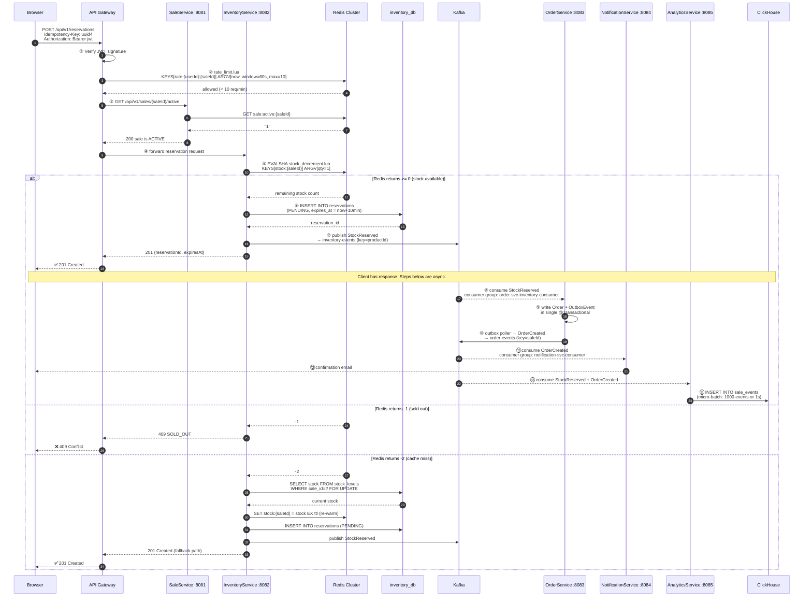

# Buy-Now-Flow.md
## Flash Sale Platform — End-to-End Purchase Flow
**Audience:** Interview preparation — whiteboard walkthrough
**Covers:** Browser → Gateway → InventoryService → Redis → Postgres → Kafka → OrderService → NotificationService → AnalyticsService

---

## Sequence Diagram



---

## Step-by-Step Walkthrough

### ① JWT verification (Gateway)

The Gateway validates the `Authorization: Bearer jwt` header before forwarding any request. It checks signature, expiry, and extracts `userId`. No request reaches a service without a verified identity.

### ② Rate limiting (Gateway → Redis)

```lua
-- rate_limit.lua — sliding window Sorted Set
-- KEYS[1]: rate:{userId}:{saleId}
-- ARGV[1]: now (epoch ms)  ARGV[2]: window (60000ms)  ARGV[3]: max (10)
redis.call('ZREMRANGEBYSCORE', KEYS[1], 0, ARGV[1] - ARGV[2])   -- evict old entries
local count = redis.call('ZCARD', KEYS[1])
if count >= tonumber(ARGV[3]) then return 0 end                  -- rate limited
redis.call('ZADD', KEYS[1], ARGV[1], ARGV[1])                   -- record this request
redis.call('EXPIRE', KEYS[1], 60)
return 1                                                          -- allowed
```

10 requests per user per sale per 60-second window. Per-sale granularity prevents a determined buyer from reserving the same product on multiple sales simultaneously.

### ③ Sale liveness check (Gateway → SaleService → Redis)

`GET sale:active:{saleId}` returns `"1"` if the sale is live. SaleService pre-warms this key 60 seconds before sale start and deletes it immediately on `ENDED` (not waiting for TTL). No request reaches InventoryService for a sale that has ended.

This is the thundering herd mitigation: 50,000 concurrent requests all hit Redis for a single `GET`. Postgres never sees a read during an active sale.

### ④ Forward to InventoryService

Gateway routes to InventoryService with the original `Idempotency-Key` header. InventoryService checks Redis and Postgres for duplicate keys before processing.

### ⑤ Lua atomic stock decrement (InventoryService → Redis)

```lua
-- stock_decrement.lua — the core oversell prevention mechanism
local stock = tonumber(redis.call('GET', KEYS[1]))
if stock == nil  then return -2 end   -- cache miss → Postgres fallback
if stock <= 0    then return -1 end   -- sold out → 409
redis.call('DECRBY', KEYS[1], ARGV[1])
return stock - tonumber(ARGV[1])      -- remaining stock
```

GET and DECRBY execute as one atomic operation on the Redis thread. No other command can run between them. This is the only point in the entire system where the oversell prevention guarantee is enforced.

### ⑥ Write reservation row (InventoryService → Postgres)

```sql
INSERT INTO reservations (user_id, sale_id, product_id, status, quantity, expires_at)
VALUES (?, ?, ?, 'PENDING', 1, NOW() + INTERVAL '10 minutes')
RETURNING id;
```

This is the durable record. Redis holds the fast counter. Postgres holds the truth.

### ⑦ Publish StockReserved (InventoryService → Kafka)

```
Topic:     inventory-events
Key:       productId                ← guarantees per-product ordering
Partition: CRC16(productId) % 16   ← routed to same shard as all events for this product
Payload:   {eventId, saleId, productId, userId, reservationId, qty, occurredAt}
```

Published **after** the Postgres INSERT succeeds. If Kafka is unavailable, the reservation still exists in Postgres.

### ⑦ → Gateway → Browser: 201 Created

The response returns here. The user has their reservation. Steps ⑧–⑭ happen without the user.

---

## Sync / Async Boundary

```
SYNCHRONOUS (user waits — P99 target ≤ 50ms):
  Steps ①–⑦: Gateway auth → rate limit → sale check → Lua DECR → Postgres write → 201

ASYNCHRONOUS (user already has response):
  Steps ⑧–⑩: OrderService creates Order via Transactional Outbox
  Steps ⑪–⑫: NotificationService sends confirmation email
  Steps ⑬–⑭: AnalyticsService writes to ClickHouse
```

A NotificationService crash at step ⑫ does not affect the 201 already delivered at step ⑦.

---

## Three Failure Paths

| Redis return | Meaning | Response |
|---|---|---|
| `>= 0` | Stock available — decremented | `201 Created {reservationId}` |
| `-1` | Stock is zero — sold out | `409 Conflict SOLD_OUT` |
| `-2` | Key missing — cache miss | Falls back to Postgres `SELECT FOR UPDATE`, re-warms Redis, returns `201` |

The `-2` path is slower (Postgres lock contention) but correct. Redis is never the source of truth.

---

## Idempotency — What Happens on Retry

Client times out at 800ms and retries with the same `Idempotency-Key: uuid4`.

```
1. Check Redis  idem:{userId}:{key}  → hit → return cached 201 response  (fast path)
2. Check Postgres idempotency_keys   → hit → return stored 201 response  (durable fallback)
3. Process → store result in both layers
```

The second request never reaches the Lua script. No second reservation is created.

---

## Interview Talking Points

**"Walk me through what happens when a user clicks Buy Now."**
Start at the Gateway: JWT verification, then rate limiting via sliding window Lua script in Redis. Sale liveness check against Redis hot key (never Postgres during active sale). InventoryService runs the atomic Lua DECR — the only point where oversell prevention is enforced. On success: Postgres INSERT, Kafka publish, 201 returned. Everything downstream is async — OrderService, NotificationService, AnalyticsService all react to the Kafka event independently.

**"Where does the 201 get sent? Before or after Kafka?"**
After the Kafka publish (step ⑦) but before any downstream consumer processes it. InventoryService publishes `StockReserved` to Kafka and then returns 201. The Kafka publish is fast (network call to the broker, no consumer acknowledgement needed). The user's response does not wait for OrderService to consume the event.

**"What is the P99 target and which steps have to complete within it?"**
P99 ≤ 50ms for steps ①–⑦: Gateway JWT + rate limit check (Redis, ~1ms) + sale liveness check (Redis, ~1ms) + Lua DECR (Redis, ~1ms) + Postgres INSERT (~5ms) + Kafka publish (~5ms). Everything downstream is asynchronous and does not count against the latency target.

---
*ADR-001 (Lua atomic decrement) · ADR-003 (Postgres fallback) · ADR-006 (Kafka async)*
*ADR-009 (dual-layer idempotency) · ADR-013 (sale hot-path in Redis)*