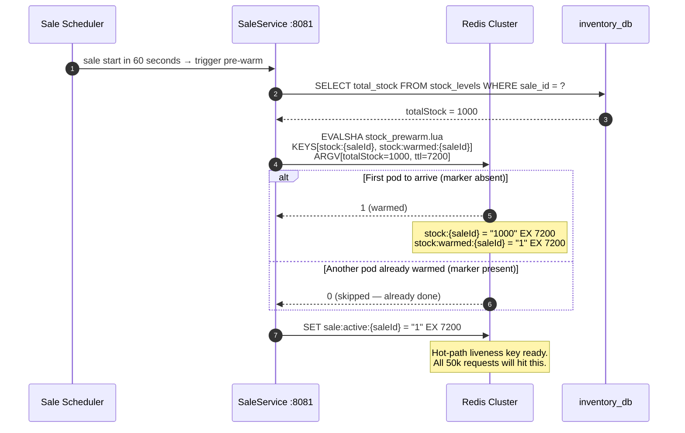
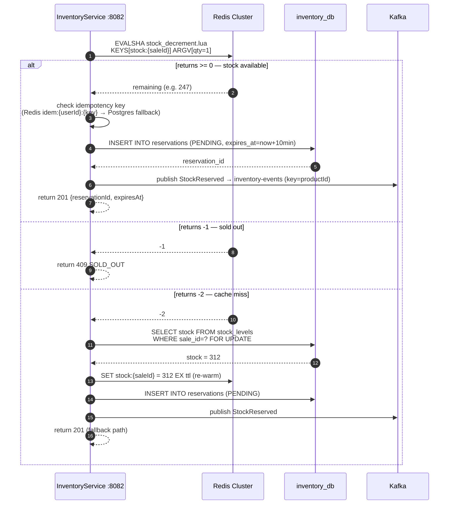

# Inventory-Reservation-Flow.md
## Flash Sale Platform — Inventory & Reservation Flow
**Audience:** Interview preparation — deep dive on stock management
**Covers:** Pre-warm → Decrement → Fallback → Release → Reconcile

---

## All Four Flows at a Glance

```
1. PRE-WARM    SaleService (60s before start) → stock_prewarm.lua → Redis warmed
2. DECREMENT   InventoryService (every reservation) → stock_decrement.lua → Redis DECR
3. RELEASE     InventoryService (expiry or cancellation) → stock_release.lua → Redis INCR
4. RECONCILE   InventoryService background job → stock_reconcile.lua → Redis corrected
```

---

## Flow 1 — Pre-Warm (60 seconds before sale start)



### Why the completion marker exists

SaleService runs as multiple pods. All pods receive the "sale starting" event simultaneously. Without coordination, all pods race to write `stock:{saleId}`. The marker key `stock:warmed:{saleId}` is the distributed write-once flag. The check and write happen inside one Lua script — atomic. Two pods cannot both see the marker absent and both write.

```lua
-- stock_prewarm.lua
local already = redis.call('GET', KEYS[2])  -- check marker
if already then return 0 end                -- skip — already warmed
redis.call('SET', KEYS[1], ARGV[1], 'EX', ARGV[2])  -- stock counter
redis.call('SET', KEYS[2], '1',     'EX', ARGV[2])  -- completion marker
return 1
```

### Hash tags — why `{saleId}` is in both key names

`stock:{saleId}` and `stock:warmed:{saleId}` both hash on `saleId` because of the `{...}` hash tag. Redis Cluster routes both to the same shard. A multi-key Lua script cannot span shards — `CROSSSLOT` error. Without hash tags, the two keys could land on different shards and the Lua script would fail.

---

## Flow 2 — Reservation (Every Buy Now click)



### The three return codes

| Code | Condition | InventoryService action |
|---|---|---|
| `>= 0` | Stock exists and was decremented | Write reservation → publish Kafka → return 201 |
| `-1` | `stock <= 0` — sold out | Return 409 immediately — nothing else |
| `-2` | Key is `nil` — not in Redis | Postgres `SELECT FOR UPDATE` → re-warm Redis → return 201 |

### The cache miss fallback — why it exists and when it fires

Redis is never the source of truth. Three scenarios produce a cache miss:
1. Sale was never pre-warmed (a bug or timing issue in the scheduler)
2. TTL expired — sale ended and the key was cleaned up, but late requests still arrive
3. Redis restarted and AOF replay missed the write

The fallback path is correct but slow. `SELECT FOR UPDATE` at 50,000 RPS produces lock contention on a single row. This is why the pre-warm path is critical — keeping the key warm for the sale's entire duration eliminates the fallback under normal operation.

---

## Flow 3 — Release (Cancellation or Expiry)

```mermaid
sequenceDiagram
    autonumber
    participant K  as Kafka
    participant IS as InventoryService :8082
    participant R  as Redis Cluster
    participant PG as inventory_db

    alt Saga compensation — order payment failed
        K->>IS: consume PaymentFailed event<br/>(order-events, consumer group: inv-svc-order-consumer)
        IS->>PG: UPDATE reservations SET status='RELEASED' WHERE id=?
    else Reservation TTL expiry
        R-->>IS: keyspace notification Ex on idem:{userId}:{key} expiry
        IS->>PG: UPDATE reservations SET status='EXPIRED' WHERE expires_at < now()
    end

    IS->>R: EVALSHA stock_release.lua<br/>KEYS[stock:{saleId}]<br/>ARGV[qty=1, ceiling=totalStock]

    alt Key exists — sale still running
        R-->>IS: new stock level (e.g. 1)
        IS->>K: publish StockReleased → inventory-events
    else Key missing — sale ended
        R-->>IS: -2
        IS: log and no-op — sale is over, stock level irrelevant
    end
```

### The ceiling — why it exists

```lua
-- stock_release.lua
local newStock = math.min(stock + qty, ceiling)
redis.call('SET', KEYS[1], newStock)
```

Kafka delivers at-least-once. A `PaymentFailed` event can arrive twice. Without the ceiling, two deliveries of "release 1 unit" add 2 units instead of 1. The ceiling (original `totalStock`) caps the restoration — stock can never exceed what was ever allocated, regardless of how many duplicate events arrive.

---

## Flow 4 — Reconcile (Background Job)

```mermaid
sequenceDiagram
    autonumber
    participant JB as Reconcile Job (scheduled)
    participant PG as inventory_db
    participant R  as Redis Cluster

    loop every 30 seconds per active sale
        JB->>PG: SELECT sale_id, total_stock - confirmed_reservations AS available<br/>FROM stock_levels WHERE status = 'ACTIVE'
        PG-->>JB: [{saleId, availableStock}]

        JB->>R: EVALSHA stock_reconcile.lua<br/>KEYS[stock:{saleId}]<br/>ARGV[pgStock, ttlSeconds]

        alt Values match
            R-->>JB: 1 (key existed, no correction needed)
        else Redis higher than Postgres
            R-->>JB: 1 (corrected — Redis decremented to match Postgres)
            JB: alert — Redis had more stock than Postgres (missed decrement)
        else Key missing
            R-->>JB: 0 (key was absent — re-set from Postgres value)
            JB: alert — Redis key was missing during active sale
        end
    end
```

### What causes drift

| Scenario | Effect |
|---|---|
| Redis restart during sale | AOF replay may miss the last second of decrements — Redis shows more stock than Postgres |
| Decrement bug | Redis decremented but Postgres INSERT failed — Redis lower than Postgres |
| TTL miscalculation | Stock key expired before sale ended — Redis shows `-2` (miss), reconciler re-warms |

### Why Postgres always wins

```lua
-- stock_reconcile.lua
if tonumber(current) ~= tonumber(ARGV[1]) then
    redis.call('SET', KEYS[1], ARGV[1], 'EX', ARGV[2])  -- Postgres value overwrites Redis
end
```

Redis is the performance layer. Postgres is the correctness layer. On any disagreement, Postgres wins.

---

## The Four Lua Scripts — Summary

| Script | Called by | Purpose | Idempotent |
|---|---|---|---|
| `stock_prewarm.lua` | SaleService scheduler | Set stock counter 60s before sale | Yes — completion marker prevents double-write |
| `stock_decrement.lua` | InventoryService per request | Atomic check-and-decrement | N/A — each call is a distinct reservation |
| `stock_release.lua` | InventoryService on cancel/expiry | Return stock with ceiling guard | Yes — ceiling prevents over-restore on duplicate events |
| `stock_reconcile.lua` | InventoryService background job | Correct Redis drift against Postgres | Yes — always converges to Postgres value |

---

## Stock Lifecycle for One Sale

```
T-60s    stock_prewarm.lua       stock:{saleId} = 1000 (from Postgres)
T+0s     sale goes ACTIVE        sale:active:{saleId} = "1"
T+0s–Xs  stock_decrement.lua     stock:{saleId} decrements: 1000→999→998→...→1→0
T+?      abandoned reservations  stock_release.lua: 0→1→2 (restored)
T+?      reconcile job           stock_reconcile.lua: corrects any drift
T+end    sale ENDED              sale:active:{saleId} deleted immediately
T+end+Δ  TTL expires             stock:{saleId} and stock:warmed:{saleId} auto-deleted
```

---

## Interview Talking Points

**"How do you ensure the stock counter never goes below zero?"**
The Lua script checks `stock <= 0` before calling `DECRBY`. The check and decrement execute atomically on the Redis thread — no other command can interleave. There is no gap between the check and the write. This is the oversell prevention guarantee.

**"What happens if Redis crashes mid-sale?"**
AOF persistence (`appendfsync everysec`) means at most 1 second of writes is lost on a crash. On restart, Redis replays the AOF log. If the stock counter was at 247 before the crash and some decrements were lost, Redis might restart at 260. The reconcile job detects this discrepancy and corrects Redis to the Postgres authoritative value within 30 seconds. Postgres always has the correct count — every reservation write goes there.

**"Why is there a 10-minute expiry on reservations?"**
Users who add to cart and abandon must have their stock released. The `expires_at = NOW() + 10 minutes` field in the `reservations` table is checked by a background expiry sweep. When a reservation expires, `stock_release.lua` returns the stock to Redis. The keyspace notification `Ex` in `redis-node.conf` fires when session-related TTL keys expire, triggering the release without polling.

**"How does the Saga compensation work if payment fails?"**
OrderService consumes a `PaymentFailed` event from `order-events`. It updates the order status to `CANCELLED`. InventoryService consumes a compensating `ReservationRelease` event from `inventory-events`, updates the reservation to `RELEASED`, and calls `stock_release.lua` to restore the stock. The ceiling in `stock_release.lua` ensures idempotency in case the Kafka event is delivered twice.

---
*ADR-001 (Lua atomic decrement) · ADR-003 (Postgres fallback) · ADR-004 (Transactional Outbox)*
*ADR-010 (Choreography saga) · ADR-011 (Redis three-layer contract)*