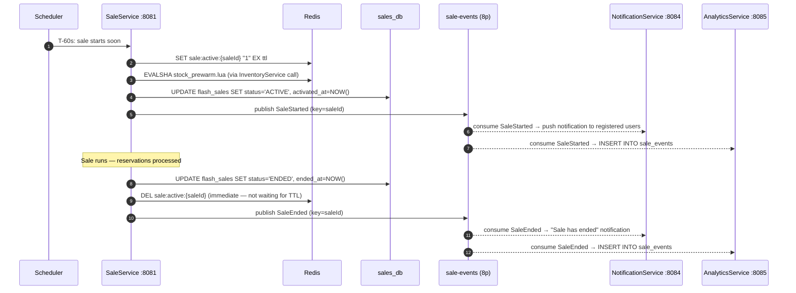
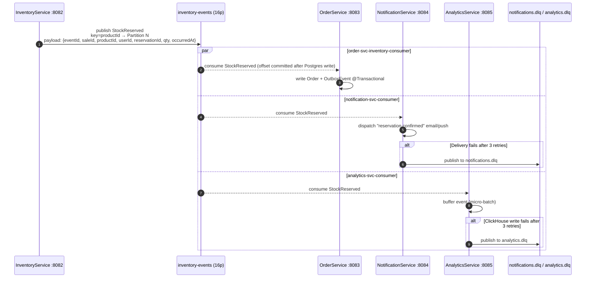
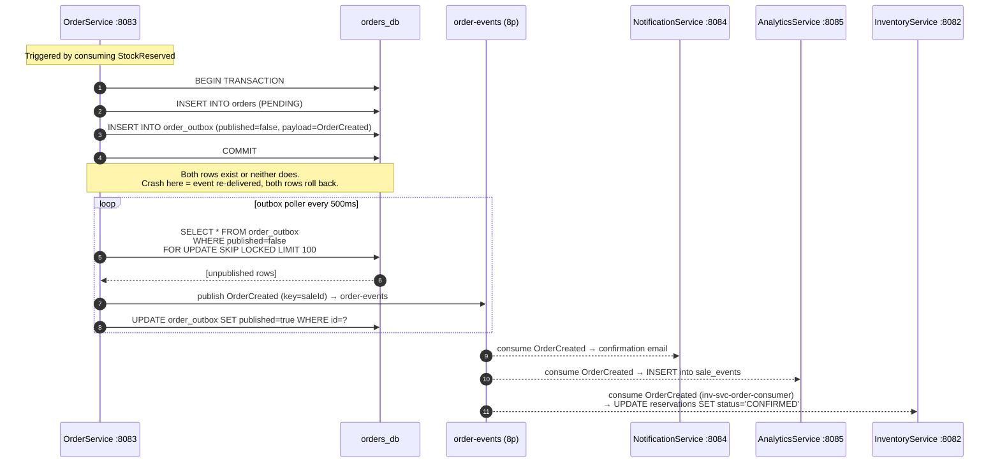
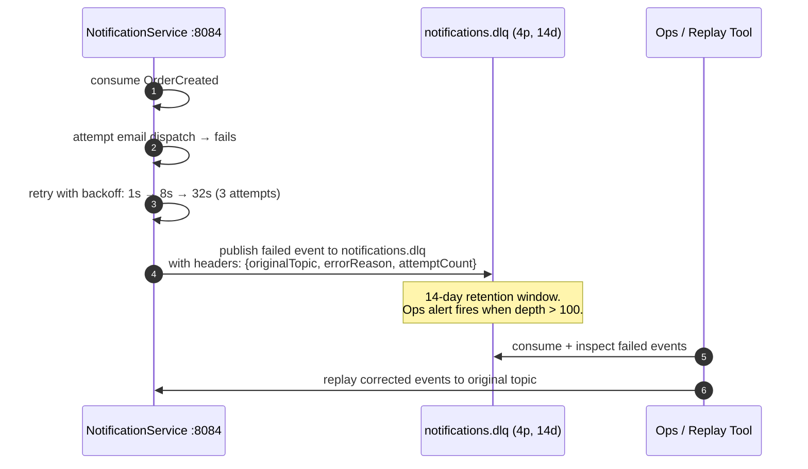

# Kafka-Event-Flow.md
## Flash Sale Platform — Kafka Event Flow
**Audience:** Interview preparation — Kafka topology and event chains
**Covers:** All three topics · Producers · Consumer groups · Outbox · DLQ · Retry

---

## Topic Topology

```
Producers                   Topics                    Consumer Groups
─────────────────────────────────────────────────────────────────────────
SaleService         →  sale-events (8p, saleId, 7d)
                                    ├──────────────→  notification-svc-consumer
                                    └──────────────→  analytics-svc-consumer

InventoryService    →  inventory-events (16p, productId, 3d)
                                    ├──────────────→  order-svc-inventory-consumer
                                    ├──────────────→  notification-svc-consumer
                                    └──────────────→  analytics-svc-consumer

OrderService        →  order-events (8p, saleId, 3d)
(via outbox)                        ├──────────────→  inv-svc-order-consumer
                                    ├──────────────→  notification-svc-consumer
                                    └──────────────→  analytics-svc-consumer

NotificationService →  notifications.dlq (4p, none, 14d)
AnalyticsService    →  analytics.dlq (4p, none, 14d)
```

---

## Flow 1 — Sale Lifecycle Events



**Why `DEL sale:active:{saleId}` immediately?**
If SaleService waited for the TTL to expire, late requests could still pass the liveness check after the sale ended. The immediate `DEL` ensures the key is gone the moment the sale transitions to `ENDED`. Every subsequent request fails at step ③ of the Buy Now flow before reaching InventoryService.

---

## Flow 2 — StockReserved Fan-out (The highest-volume event)



**Why `productId` as partition key — not `saleId`:**
Two concurrent reservations for the same product must be processed sequentially by `order-svc-inventory-consumer`. `productId` guarantees both events land on the same partition and are consumed by the same pod in strict arrival order. `saleId` would scatter same-product events across partitions — two pods could process them concurrently, breaking per-product ordering.

**Why 16 partitions — not 8:**
`inventory-events` is the highest-throughput topic. Every reservation produces one event. 16 partitions = up to 16 concurrent OrderService consumer pods processing reservations in parallel. Maximum throughput at peak load.

---

## Flow 3 — OrderCreated via Transactional Outbox



### Why not just call `kafkaTemplate.send()` directly?

```java
// WRONG — two operations, no atomicity
orderRepository.save(order);         // committed to Postgres
kafkaTemplate.send("order-events");  // if this fails → event permanently lost
```

If the process crashes between these two lines, the Order exists in Postgres but `OrderCreated` is never published. NotificationService never fires. InventoryService never confirms the reservation. The outbox makes the event part of the database transaction — both rows commit or both roll back.

### `FOR UPDATE SKIP LOCKED` — the multi-pod detail

Multiple OrderService pods run the poller simultaneously. Without `SKIP LOCKED`, two pods would lock the same 100 rows and both publish the same events. `SKIP LOCKED` causes a pod to skip rows already locked by another pod. Each pod receives a distinct set. No duplicates. No blocking between pods.

---

## Flow 4 — DLQ and Retry



**DLQ retention is 14 days** — longer than the main topics (3–7 days). Failed events must outlive the original to allow investigation and replay.

**Error classification** determines whether to DLQ immediately or retry:
- `EmailProviderRateLimitException` → retry with backoff
- `InvalidEmailAddressException` → DLQ immediately (retrying won't fix it)
- `EmailProviderUnavailableException` → retry 3× then DLQ

---

## Consumer Group Reference

| Consumer group | Topic | Service | What it does |
|---|---|---|---|
| `order-svc-inventory-consumer` | `inventory-events` | OrderService | Creates Order + OutboxEvent on each `StockReserved` |
| `inv-svc-order-consumer` | `order-events` | InventoryService | Confirms reservation to `CONFIRMED` on `OrderCreated` |
| `notification-svc-consumer` | all three topics | NotificationService | Dispatches email/push per event type |
| `analytics-svc-consumer` | all three topics | AnalyticsService | Micro-batch inserts to ClickHouse |

**Fan-out rule:** `notification-svc-consumer` and `analytics-svc-consumer` each read all three topics independently. Publishing one event to `inventory-events` results in three independent consumers all processing it — OrderService, NotificationService, and AnalyticsService — without any coordination between them.

---

## Kafka Config Decisions

| Setting | Value | Reason |
|---|---|---|
| `AUTO_CREATE_TOPICS_ENABLE` | `false` | Services own their topics via `@Bean KafkaTopicConfig`. Typo → fail loudly, not create phantom topic |
| `acks` | `all` | No message acknowledged until all in-sync replicas wrote it. Zero message loss on broker failover |
| `enable.idempotence` | `true` | Broker deduplicates producer retries. Exactly-once producer semantics |
| `enable.auto.commit` | `false` | Offset committed only after successful processing. Prevents skipped messages on pod crash |
| `inventory-events` partitions | 16 | Double other topics — highest reservation throughput at flash sale peak |
| Partition key strategy | `productId` for inventory, `saleId` for sale/order | Per-product ordering for saga; per-sale ordering for lifecycle events |

---

## Interview Talking Points

**"What happens if OrderService is slow and building up consumer lag?"**
Consumer lag on `order-svc-inventory-consumer` is visible at `make kafka-lag`. The lag grows. Kafka retains the events — 3-day retention means nothing is lost. OrderService can be scaled horizontally up to 16 pods (one per partition) to drain the backlog. The buyer's 201 was already delivered. The order creation is eventually consistent — visible to the buyer when they refresh their order history.

**"What guarantees that OrderCreated is never lost even if Kafka is down?"**
The Transactional Outbox. `order_outbox` rows accumulate in `orders_db` during Kafka unavailability. The poller retries every 500ms. When Kafka recovers, the poller drains the backlog. The events are never lost — they live in Postgres until `published=true`.

**"Two OrderService pods both run the outbox poller. How do they avoid publishing the same event twice?"**
`FOR UPDATE SKIP LOCKED`. Rows locked by pod A are invisible to pod B. Pod B skips them and picks up unlocked rows instead. Each pod processes a distinct non-overlapping set. No duplicates. No deadlock (SKIP LOCKED never waits — it moves on immediately).

**"What is the difference between at-least-once and exactly-once delivery in your architecture?"**
Producers use `enable.idempotence=true` for exactly-once at the broker level — no duplicate messages from producer retries. Consumers are at-least-once — a message can be re-delivered if the pod crashes after processing but before committing the offset. All consumers handle this with `eventId` deduplication: if an `eventId` was already processed (checked in Redis or Postgres), the message is acknowledged and skipped.

---
*ADR-006 (Kafka async fan-out) · ADR-007 (partition key strategy)*
*ADR-008 (Transactional Outbox) · ADR-017 (Kafka KRaft)*