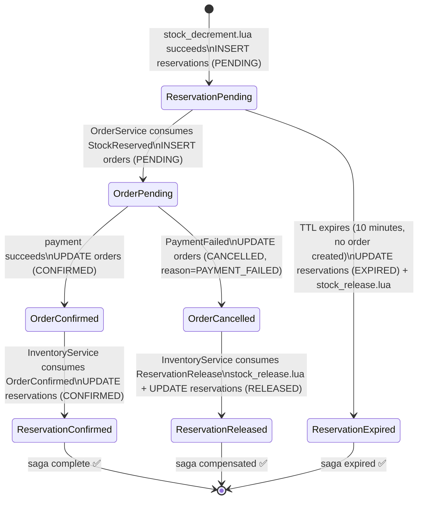
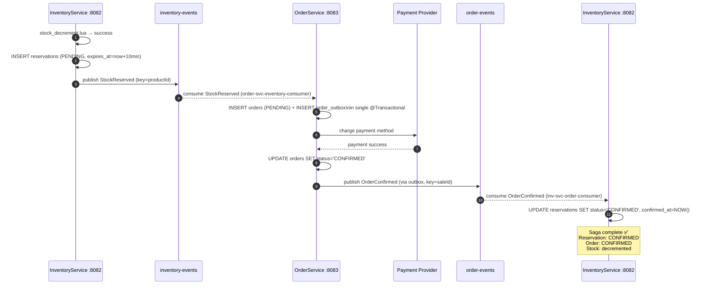
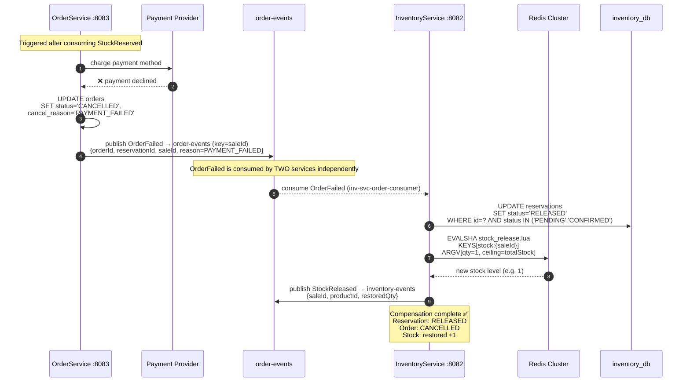
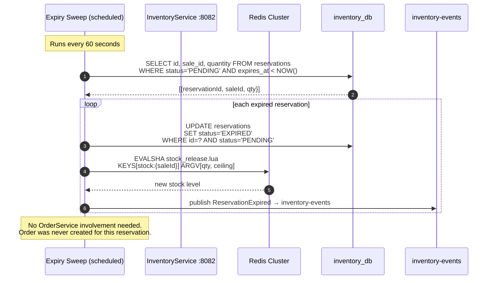
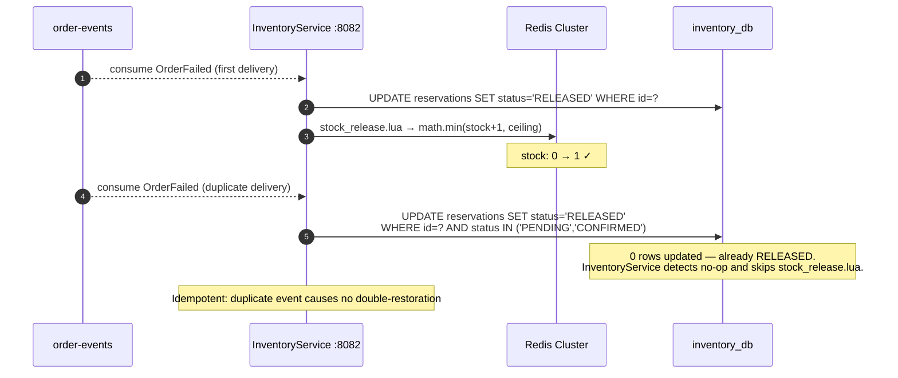
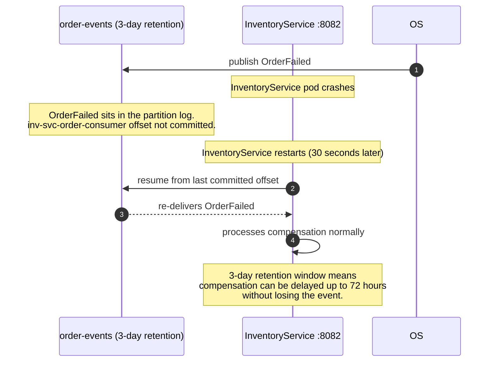

# Saga-Compensation-Flow.md
## Flash Sale Platform — Saga Compensation Flow
**Audience:** Interview preparation — distributed rollback across services
**Covers:** Happy saga · PaymentFailed compensation · Partial failure scenarios · Choreography vs orchestration

---

## What a Saga Is

A saga is a sequence of local transactions, each in a different service, coordinated to achieve a business outcome. If any step fails, compensating transactions undo the completed steps in reverse order.

In a monolith: `BEGIN; do everything; COMMIT or ROLLBACK`. One database, one transaction.

In a distributed system with no shared database: there is no ROLLBACK. Each service committed its own local transaction. To "undo" the overall flow, you must call each service and explicitly reverse what it did.

Your platform uses **choreography-based saga** — no central orchestrator. Each service reacts to events and publishes its own compensating events when it fails.

---

## The Full Saga — All Paths

---

## Flow 1 — Happy Path Saga

---

## Flow 2 — Compensation: Payment Fails

### The compensation is fire-and-forget at each step

OrderService does not wait to hear that InventoryService released the stock. It publishes `OrderFailed` and its responsibility ends. InventoryService consumes `OrderFailed` independently. This is choreography: each service reacts to what happened, rather than being told what to do by a coordinator.

---

## Flow 3 — Compensation: Reservation Expiry (No payment reached)

The 10-minute expiry window gives the user time to complete checkout. If they abandon the cart, the stock is returned — without any user action. Other users waiting in the queue can now purchase that unit.

---

## Flow 4 — What Happens If the Compensating Event Is Delivered Twice

Kafka is at-least-once. The `OrderFailed` event can be delivered to InventoryService twice.

Two guards prevent double-restoration:

**Guard 1 — Postgres status check:** `UPDATE reservations SET status='RELEASED' WHERE id=? AND status IN ('PENDING','CONFIRMED')` — if the reservation is already `RELEASED`, this returns 0 rows. InventoryService skips the Redis call.

**Guard 2 — Ceiling in `stock_release.lua`:** Even if the Postgres check is bypassed, `math.min(stock + qty, ceiling)` prevents stock from exceeding the original total. A second release attempt restores no more than the ceiling allows.

---

## Flow 5 — What Happens If InventoryService Is Down During Compensation

The offset is not committed until after the compensation successfully writes to Postgres and Redis. If InventoryService crashes mid-processing, the event is re-delivered on restart. The 3-day `order-events` retention provides a 72-hour recovery window — far longer than any expected outage.

---

## Why Choreography, Not Orchestration

Your platform uses choreography for this saga. The alternative is a central `SagaOrchestrator` service that tells each service what to do at each step.

| | Choreography (your platform) | Orchestration (rejected) |
|---|---|---|
| Coordination | Each service reacts to events it cares about | Central orchestrator calls each service in sequence |
| Coupling | Services know events, not each other | Services know the orchestrator |
| SPOF | None — any service can fail independently | Orchestrator failure stops the entire saga |
| Visibility | Requires distributed tracing to follow the flow | Flow is explicit in the orchestrator's state machine |
| Complexity | Implicit flow — harder to visualise | Explicit flow — easier to visualise |
| Scale | Each service scales independently | Orchestrator can become a bottleneck |

**Why choreography is correct for this platform at 5 services:**
At 5 services, the implicit flow is manageable and documented explicitly (this document). The absence of a SPOF orchestrator means a NotificationService outage does not block compensation. Each service's consumer group processes independently — InventoryService compensation proceeds even if NotificationService is slow.

**When to choose orchestration instead:**
Above ~10 services where the implicit flow becomes operationally unobservable without tracing. Also when the saga has complex branching logic or retry policies that are better expressed as code in an orchestrator than as events across services.

---

## Saga State per Entity

After each step, every entity has a clear state. No ambiguity.

| Saga step | `reservations.status` | `orders.status` | Redis `stock:{saleId}` |
|---|---|---|---|
| After Lua DECR | `PENDING` | — | decremented by 1 |
| After OrderService processes | `PENDING` | `PENDING` | decremented |
| After payment success | `PENDING` | `CONFIRMED` | decremented |
| After inventory confirms | `CONFIRMED` | `CONFIRMED` | decremented |
| After payment failure | `RELEASED` | `CANCELLED` | restored +1 |
| After TTL expiry | `EXPIRED` | — (never created) | restored +1 |

---

## Interview Talking Points

**"What happens if a user's payment fails after their reservation was confirmed?"**
OrderService marks the order `CANCELLED` with `cancel_reason=PAYMENT_FAILED` and publishes `OrderFailed` to `order-events`. InventoryService consumes it, marks the reservation `RELEASED`, and calls `stock_release.lua` to restore the stock counter in Redis. The entire compensation is event-driven — no service calls another directly. The stock becomes available for the next buyer.

**"How do you guarantee the stock is always restored after a failed payment, even if InventoryService is temporarily down?"**
`order-events` has 3-day retention. The `OrderFailed` event sits in the partition log. InventoryService's consumer offset is not committed until after the compensation succeeds. When InventoryService restarts, it re-reads from its last committed offset and processes the compensation. The event is never permanently lost.

**"What prevents the same `OrderFailed` event from restoring stock twice?"**
Two guards. First, the Postgres `UPDATE reservations SET status='RELEASED' WHERE id=? AND status IN ('PENDING','CONFIRMED')` returns 0 rows if the reservation is already `RELEASED` — InventoryService detects the no-op and skips the Redis call. Second, `stock_release.lua` uses `math.min(stock + qty, ceiling)` — the ceiling (original total stock) prevents the counter from exceeding what was ever allocated, regardless of how many duplicate events arrive.

**"What is the difference between choreography and orchestration? Why did you choose choreography?"**
Choreography: each service reacts to events it cares about. No central coordinator. Any service can fail independently without blocking others. Orchestration: a central service calls each step in sequence — it is a SPOF, and its failure blocks the entire flow. At 5 services, choreography is correct — the flow is documented explicitly, distributed tracing provides visibility, and no single orchestrator can bottleneck the system. Above ~10 services, orchestration becomes more practical because the implicit choreography flow becomes too complex to reason about.

**"What is a compensating transaction and how does it differ from a rollback?"**
A database rollback undoes uncommitted changes within a single transaction — as if the writes never happened. A compensating transaction is a new, separate transaction that reverses the effect of a previously committed transaction. In a distributed saga, each service has already committed its own local transaction. There is no shared transaction to roll back. To undo the effect, each service must execute a deliberate compensating action — `UPDATE reservations SET status='RELEASED'`, `stock_release.lua`, etc. The intermediate committed states are visible to the system during compensation. A rollback hides them entirely.

---
*ADR-010 (Choreography-based saga) · ADR-008 (Transactional Outbox)*
*ADR-006 (Kafka async fan-out) · ADR-001 (Lua atomic decrement)*
*`inventory_db.reservations` · `orders_db.orders` · `stock_release.lua`*