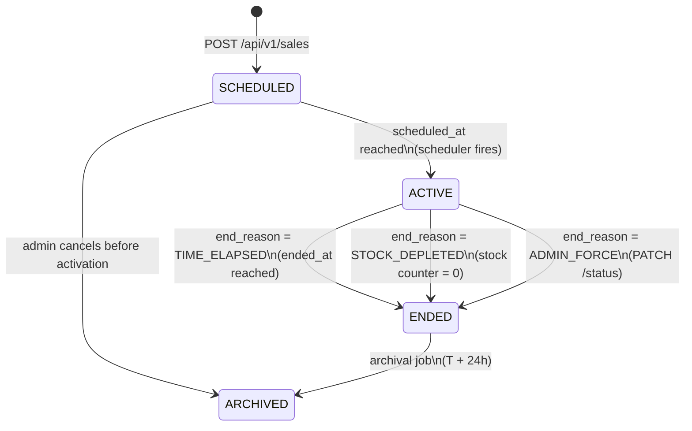
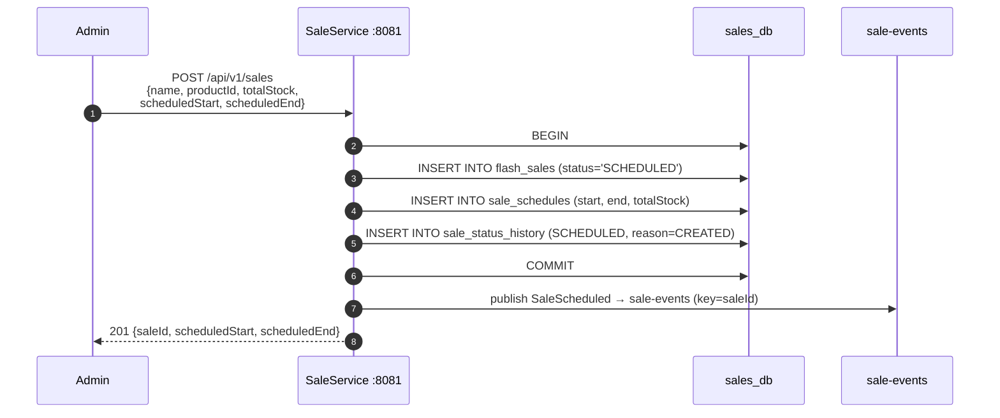
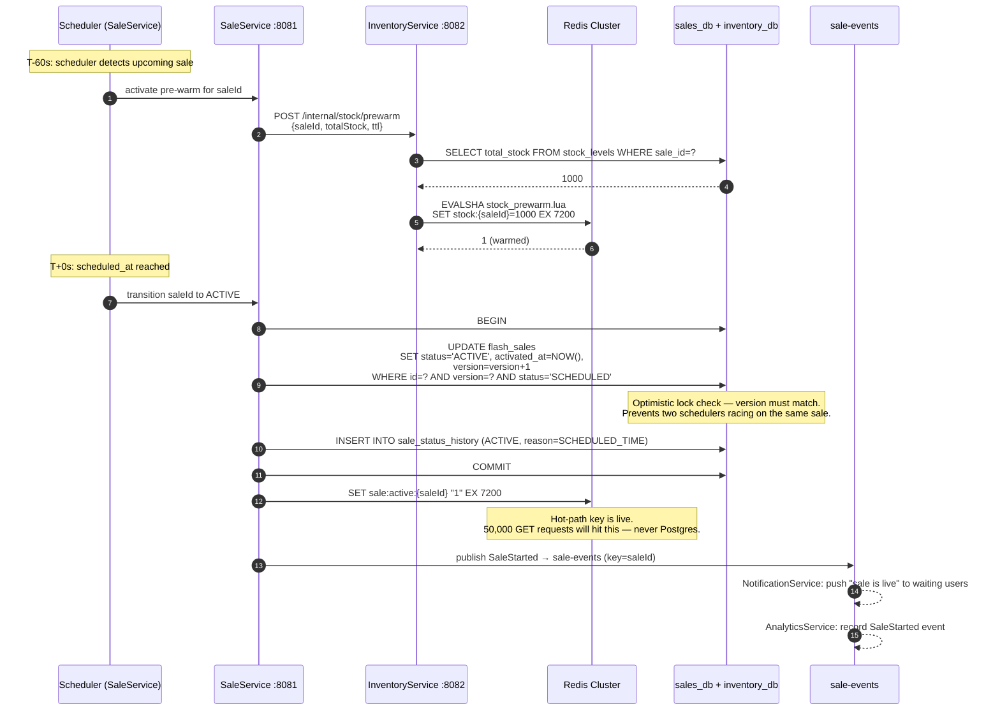
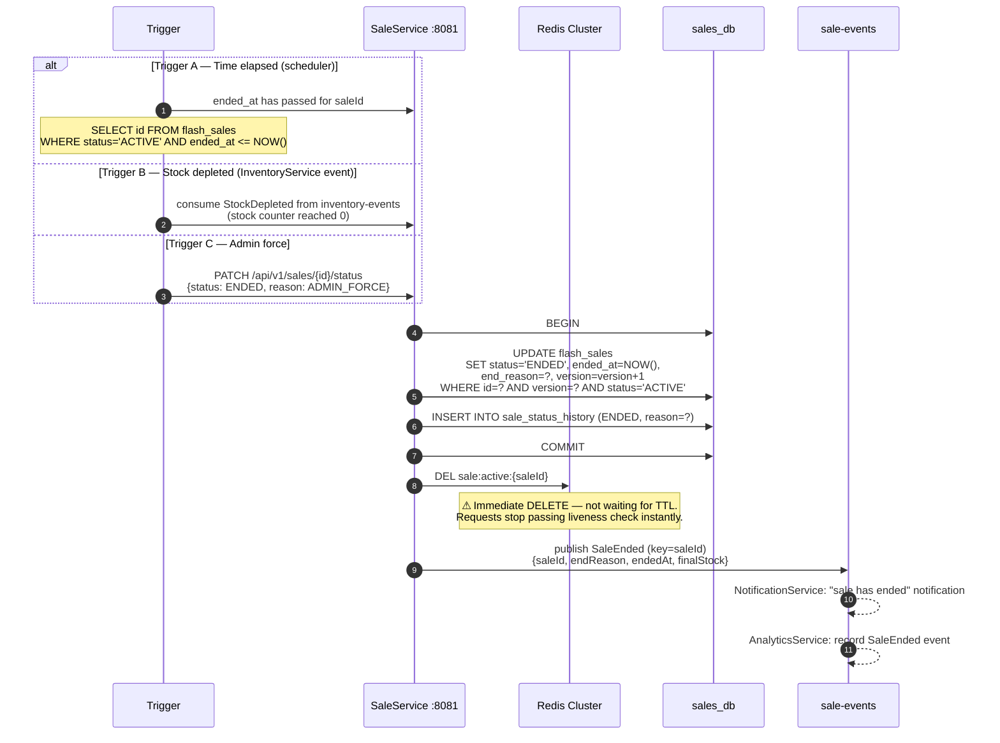
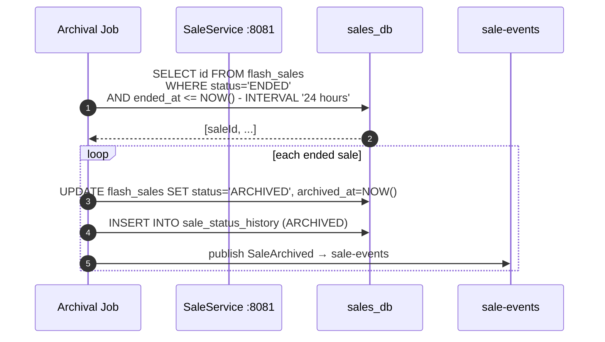

# Sale-Lifecycle-Flow.md
## Flash Sale Platform — Sale Lifecycle Flow
**Audience:** Interview preparation — state machine and activation mechanics
**Covers:** SCHEDULED → ACTIVE → ENDED → ARCHIVED · Pre-warm · Thundering herd · Force-end

---

## State Machine



**Schema from `sales_db.flash_sales`:**

```sql
status       VARCHAR(20) CHECK (status IN ('SCHEDULED','ACTIVE','ENDED','ARCHIVED'))
end_reason   VARCHAR(50)        -- TIME_ELAPSED | STOCK_DEPLETED | ADMIN_FORCE
activated_at TIMESTAMPTZ        -- null until SCHEDULED→ACTIVE
ended_at     TIMESTAMPTZ        -- null until ACTIVE→ENDED
archived_at  TIMESTAMPTZ        -- null until ENDED→ARCHIVED
version      BIGINT             -- optimistic lock, incremented on every transition
```

Every transition is appended to `sale_status_history` — an immutable audit log. The `flash_sales` row is mutated but the history is append-only.

---

## Flow 1 — Creating a Scheduled Sale



`sale_schedules` is immutable once the sale transitions to `ACTIVE`. Changing the start time of a live sale is an illegal state transition — enforced at the application layer via optimistic lock check on `flash_sales.version`.

---

## Flow 2 — Sale Activation (The thundering herd moment)

This is the most critical flow. At T+0, tens of thousands of users have their browsers open, waiting. Everything that happens in the 60 seconds before T+0 determines whether those requests hit Redis or collapse Postgres.



### Why `sale:active:{saleId}` is set AFTER the Postgres commit

If Redis is set first and the Postgres commit fails, requests would pass the liveness check for a sale that is not officially active. Postgres commits first — the sale is officially active. Redis is set next — the hot path is armed. The window between commit and Redis SET is milliseconds. During that window, requests fall through to the slightly slower SaleService HTTP check, then Redis is armed and takes over.

### Why optimistic locking on the ACTIVE transition

```sql
UPDATE flash_sales
SET status='ACTIVE', version=version+1
WHERE id=? AND version=? AND status='SCHEDULED'
-- If 0 rows updated: another pod already activated it, or it is not in SCHEDULED state
```

Multiple SaleService pods run the scheduler simultaneously. Without the version check, two pods could both detect the sale needs activation and both attempt the transition. The optimistic lock ensures exactly one succeeds — the other gets 0 rows updated and aborts.

---

## Flow 3 — Sale End (Two triggers)



### Why `DEL` and not TTL expiry

If SaleService relied on the TTL to clean up `sale:active:{saleId}`, late requests would keep arriving after the sale ended — for however long the TTL had remaining. A sale with a 2-hour TTL on the active key could continue accepting reservations for up to 2 hours after the transition to `ENDED`. The immediate `DEL` means the next request after the transition fails the liveness check at step ③ of the Buy Now flow, before reaching InventoryService.

### Stock depleted end reason — who detects it

InventoryService tracks the current stock counter. When `stock_decrement.lua` returns `0` (last unit sold), InventoryService publishes a `StockDepleted` event to `inventory-events`. SaleService consumes it and transitions the sale. This is choreography — InventoryService does not call SaleService directly. Each service reacts to events.

---

## Flow 4 — Archival (T + 24h after ENDED)



`ARCHIVED` is the terminal state. No further transitions are permitted. The `sale_status_history` table becomes the permanent record of what happened and when.

---

## What Cannot Change Once ACTIVE

```
sale_schedules    → immutable (start time, end time, total stock)
flash_sales.name  → immutable
flash_sales.total_stock → immutable
```

`sale_schedules` immutability is enforced at the application layer: any write attempt after `status = 'ACTIVE'` performs a version check on the parent `flash_sales` row. If the sale is active, the write is rejected.

---

## Status History — Append-Only Audit

```sql
-- sale_status_history (from schema.sql)
-- Every transition appended here — never updated, never deleted
CREATE TABLE sale_status_history (
    id          UUID PRIMARY KEY DEFAULT gen_random_uuid(),
    sale_id     UUID NOT NULL REFERENCES flash_sales(id),
    from_status VARCHAR(20),    -- null on first entry (CREATED)
    to_status   VARCHAR(20) NOT NULL,
    reason      VARCHAR(100),   -- SCHEDULED_TIME | STOCK_DEPLETED | ADMIN_FORCE | ...
    transitioned_by VARCHAR(100),  -- scheduler | admin:{userId} | system
    transitioned_at TIMESTAMPTZ NOT NULL DEFAULT NOW()
);
```

A GDPR audit or a post-incident investigation can reconstruct the full lifecycle of any sale from this table. The `flash_sales` row shows current state. `sale_status_history` shows every state it was ever in.

---

## Interview Talking Points

**"What happens at the exact moment a sale starts?"**
The scheduler detects `scheduled_at <= NOW()` for sales in `SCHEDULED` state (partial index on that condition). SaleService transitions the row to `ACTIVE` with an optimistic lock check. It sets `sale:active:{saleId}` in Redis. It publishes `SaleStarted` to Kafka. The pre-warm happened 60 seconds earlier so `stock:{saleId}` is already in Redis. The moment Redis is set, 50,000 concurrent `GET sale:active:{saleId}` calls return `"1"` and the requests flow through.

**"How do you prevent 50,000 users from collapsing Postgres at sale start?"**
Two steps. First, `stock:{saleId}` is pre-warmed 60 seconds before start — all reservation decisions use the Redis counter, Postgres is never read during an active sale. Second, `sale:active:{saleId}` is a single Redis GET — no Postgres query needed to answer "is this sale live?". The entire hot path for an active sale is Redis → Redis → Redis → Postgres write (reservation INSERT). The read path never touches Postgres.

**"What is `end_reason` and what values can it take?"**
`TIME_ELAPSED` — the scheduled end time passed and the scheduler detected it. `STOCK_DEPLETED` — InventoryService published `StockDepleted` when the counter hit zero. `ADMIN_FORCE` — an administrator explicitly ended the sale via `PATCH /api/v1/sales/{id}/status`. The reason is stored on `flash_sales` and recorded in `sale_status_history` for audit purposes.

**"Two SaleService pods both detect a sale needs activation simultaneously. What happens?"**
The optimistic lock on `flash_sales.version` prevents double-activation. Both pods attempt: `UPDATE flash_sales SET status='ACTIVE', version=version+1 WHERE id=? AND version=N AND status='SCHEDULED'`. Only one succeeds — the other gets 0 rows updated and treats it as "already activated, nothing to do." No duplicate activation, no duplicate `SaleStarted` event.

**"Why is `ARCHIVED` a separate status from `ENDED`?"**
`ENDED` means the sale is over but still operationally relevant — customer support may be resolving disputes, orders may still be in flight, reservations may still be confirming. `ARCHIVED` means the sale is fully resolved and read-only. The 24-hour window between `ENDED` and `ARCHIVED` gives the operations team time to handle post-sale issues before the record is frozen. It also allows batch reports to be generated from the `ENDED` state before archival.

---
*ADR-009 (5-service model) · ADR-013 (SaleService Redis hot-path)*
*`sales_db.flash_sales` · `sales_db.sale_status_history` · `sales_db.sale_schedules`*